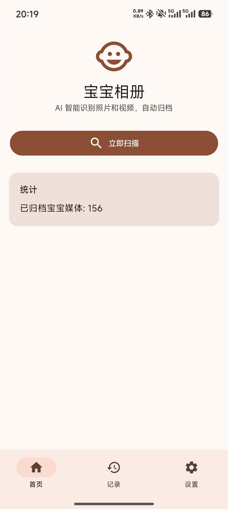
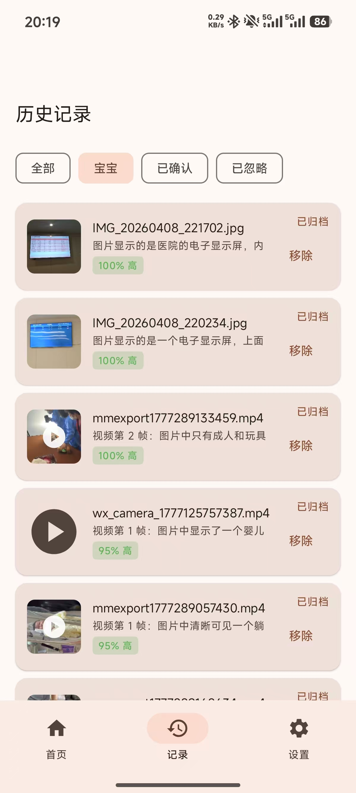
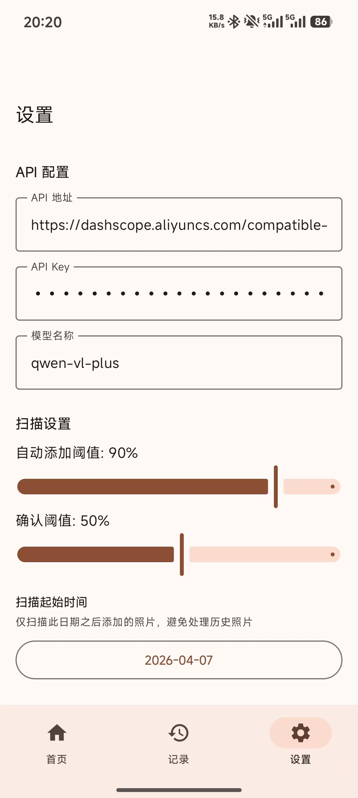

# Baby Photos Archive（宝宝照片归档）

**宝宝照片归档** 是一款安装在 **安卓手机** 上的相册整理工具，适合 **有 0～3 岁宝宝的家庭**：日常随手拍很多，真正和宝宝相关的照片、视频却分散在相册各处，事后一张张翻找、归类很费时间。应用帮你在本地完成「**筛出来 → 归到一处**」：自动找出画面里 **疑似带宝宝** 的素材，整理进 **专属的宝宝相册**；对不太有把握的内容，会先 **请你确认** 再收录，尽量避免误收。

**使用方式**：你在应用里填入自己已开通的 **AI 看图服务**（各家在线大模型均可，按服务商说明自行开通与付费）；应用 **不提供云相册、也不代管你的照片**，所有媒体始终留在本机，由你控制何时扫描、是否纳入宝宝相册。

> 请勿在 Issue、截图或公开场合泄露你在应用内填写的 **服务密钥**。

---

## 特性 & 亮点

1. **纯本地，无自建服务端**：扫描、缓存、识别记录均在设备上完成；仅按你的配置调用第三方视觉 API，应用不托管用户相册。
2. **「0 副本」式归档，更省空间**：符合条件时采用**移动**文件到 `Pictures/BabyAlbum`（并刷新 MediaStore），而不是在归档目录再**完整复制**一份媒体，避免「原图 + 归档各存一份」的双倍占用（上传识别仍使用压缩后的编码数据，不另存一份「待传原图」）。
3. **与系统相册一致**：依赖 MediaStore 扫描与归档后 `scanFile` 等刷新逻辑，文件仍在用户可见的公共图片目录树下，系统相册、文件管理器可正常展示新位置。
4. **图片与视频兼顾**：相册扫描覆盖图片与视频；视频通过抽帧生成静态图再走同一套视觉识别与分类流程（详见 `VideoFrameExtractor`、`PhotoScanner`）。
5. **少打扰、可省钱**：Room 记录已分析路径，避免对同一文件重复调用模型；并发上限控制（如 `Semaphore`）降低瞬时流量与 API 压力。
6. **分级自动化**：高置信度可自动归档，中置信度需用户确认后再移动，降低误操作风险。

---

## 功能概览

- **本地扫描**：基于 MediaStore 发现待分析图片（含「今日新增」等流程，详见 `ORIGIN.md`）。
- **预处理**：缩放、JPEG 压缩、Base64，降低带宽与调用成本。
- **视觉识别**：调用 `/v1/chat/completions`，解析模型返回的 JSON（`contains_baby`、`confidence`、`reason`），兼容部分模型用 markdown 代码块包裹 JSON 的情况。
- **分类与归档**（默认规则，与 `ClassificationEngine` 一致）：
  - **置信度 ≥ 80**：可自动加入宝宝相册（具体行为以应用内逻辑为准）。
  - **50～79**：需用户确认后再归档。
  - **低于 50** 或判定不含宝宝：忽略。
- **去重与记录**：已分析路径写入 Room，避免对同一张照片重复调用 API。
- **后台任务**：WorkManager 周期性扫描（需网络等约束，详见代码与 `ORIGIN.md`）。

<p align="center">  </p>

---

## 使用说明

1. **底部导航**：**首页**（扫描与待确认）、**记录**（历史识别与详情）、**设置**（API 与扫描参数）。
2. **首次使用前**：打开 **设置**，填写 **API 地址**、**API Key**、**模型名称**（须支持视觉/多模态），按需设置 **扫描起始时间**（只处理该日期之后进入相册的媒体，避免扫全库）、**自动添加阈值** / **确认阈值**、图片预处理参数，点 **保存设置**。未完成 API 配置时，首页 **立即扫描** 不可用。
3. **扫描与权限**：在 **首页** 点 **立即扫描**；按系统提示授予 **相册/图片与视频读取**；若要将文件 **移动** 到 `Pictures/BabyAlbum`，需按应用引导开启 **管理所有文件**（或机型等效项）。授权后再次扫描即可。
4. **结果与归档**：扫描结束后，高置信媒体可按规则 **自动** 移入宝宝相册；置信度居中的会出现在 **待确认** 列表，可单条处理，或使用 **全部确认** / **全部跳过**。归档后可在系统相册的上述目录中查看。
5. **后台**：在满足网络等条件时，应用会通过 **WorkManager** 做周期性扫描，与手动扫描共用同一套逻辑与记录。

---

## 技术栈

| 类别 | 选型 |
|------|------|
| 语言 / JVM | Kotlin 2.1、JVM 17 |
| UI | Jetpack Compose、Material 3、Navigation Compose |
| 本地存储 | Room + KSP |
| 后台 | WorkManager |
| 网络 | OkHttp、Retrofit、Moshi |
| 图片 | Coil、Bitmap 预处理 |

**Gradle / Android**：Android Gradle Plugin 8.7，`compileSdk` / `targetSdk` 34，`minSdk` 26。

---

## 环境要求

- **JDK 17**
- **Android Studio**（推荐 Hedgehog 及以上）或已配置 Android SDK 的命令行环境

---

## 构建与检查

在仓库根目录执行：

```bash
./gradlew :app:assembleDebug
./gradlew :app:lintDebug
./gradlew :app:testDebugUnitTest
```

---

## 从源码构建

1. 使用 Android Studio 打开本仓库，同步 Gradle。
2. 在应用内 **设置** 中配置：
   - 兼容 OpenAI 的 **Base URL**（如 `https://api.openai.com/` 或自建网关）
   - **API Key**（仅保存在本机，勿提交到 Git）
   - **模型名称**（需支持 Vision / 多模态消息）
3. 授予相册与存储相关权限；部分机型归档到公共目录可能涉及 **管理所有文件** 等高敏权限，请仅在理解风险的前提下使用。
4. 首次使用建议先 **手动扫描小批量**，确认归档路径与误判情况后再依赖自动或后台流程。

更完整的产品与技术说明见根目录 [**ORIGIN.md**](ORIGIN.md)；贡献者与 Agent 约定见 [**AGENTS.md**](AGENTS.md)。

---

## 权限与隐私提示

- 应用会读取图片（及清单中声明的视频读取权限，以实际代码使用为准），并可能将文件 **移动** 到 `Pictures/BabyAlbum`，**不会**在 README 中描述任何静默删除原图或批量不可逆策略以外的行为；修改 `AlbumManager` 等模块时请格外谨慎。
- **API Key、完整请求体、Base64 图片、含隐私的模型原文** 不应写入日志或对外分享。
- 开源前请自行审查 `AndroidManifest.xml` 中的权限是否与你的产品定位一致；若上架应用商店，需准备 **隐私政策** 与 **数据出境/API 说明**（如适用）。

---

## 目录结构（摘要）

```
app/src/main/java/com/babyphotos/archive/
├── data/local/          # Room 实体与 DAO
├── data/repository/     # 扫描、识别、归档编排（如 AnalysisRepository）
├── domain/scanner/      # MediaStore 扫描
├── domain/preprocessor/ # 图片压缩与 Base64
├── domain/recognizer/   # 视觉 API 调用与解析
├── domain/classifier/   # 阈值决策
├── domain/album/        # 移动文件与刷新 MediaStore
├── ui/                  # Compose 界面与导航
└── worker/              # WorkManager 任务
```

---

## 参与贡献

欢迎 Issue / PR。提交前请尽量：

- 保持分层清晰（UI 不承载重业务流程）。
- 涉及权限、文件移动、数据库迁移、后台策略的改动，在 PR 中说明动机与验证方式。
- 不引入非必要的大型依赖（与 `AGENTS.md` 约定一致）。

---

## 免责声明
- 本工具依赖第三方视觉模型的判断，**可能存在误判或漏判**。
- 使用大模型 API 会有一定的成本，请根据实际情况选择是否使用。
- 归档操作为真实文件移动，使用前请自行备份重要数据。
- 作者与贡献者不对因使用本软件造成的任何直接或间接损失承担责任。
